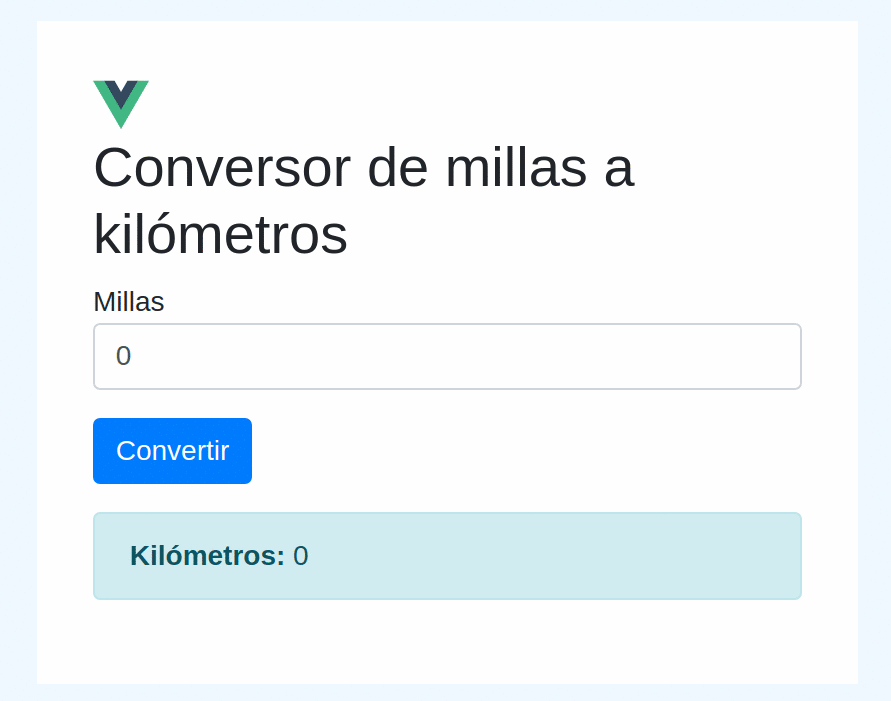

# Conversor de millas a kilómetros

El típico ejemplo del conversor de millas a kilómetros, ideal para conocer la arquitectura Vue.JS.



El conversor es el principal componente de la aplicación, [ConversorPage.vue](src/components/ConversorPage.vue), que se divide en tres secciones:

- el **template** o HTML, con
    - un input type text millas con binding bidireccional
    - el botón que tiene un binding del evento on click para disparar la conversión
    - un label kilómetros que muestra el valor convertido
- el **componente** delega la responsabilidad a un objeto de dominio conversor (en otras variantes podría tomar su lugar)
- el objeto de dominio **conversor** que define dos propiedades kilómetros y millas y un método convertir() con la "lógica de negocio"

## Project setup
```
npm install
```

### Compiles and hot-reloads for development
```
npm run serve
```

### Compiles and minifies for production
```
npm run build
```

### Lints and fixes files
```
npm run lint
```

### Run your unit tests
```
npm run test:unit
```
